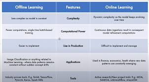

# ---------Start-----------------------------
# Learcture -1
### what is the Machine Learning?
- Machine learning is a fild fo computer science that use statical techinques to give computer systems the ability to "learn" with data, without begin explicitly programmed.

# Learcture - 2
## [AI vs Machine learning vs Deep-learning]()
- we are using AI write now pattern requation.
- because we don't know the equation of love and feeling, creativity so it's not a fully AI it is the subpart of AI because we using pattern requation.

### deep learning
- deep lerning is  a machine learning. but little bit different they are inspire by nuriouns.

# Day = 3

### Types of Machine Learning
1. Supervised  (you have input and output both)
- Regression (identify -> number)
- Classification (identify -> categries like yess , or no etc.)
2. Unsupervised ( you have only intput data and find pattern like.)
- Clustring
- Dimensnility reduction
- Anamoly detecton reduction
- Assosication Rule learning
3. SemiSupervised 
4. Reinforement
---
## Supervised Learning
---
### General:-
- Date are 2-type 
1. Numerical (ex- age, weigth, iq)
2. Categerical (ex- gender)

# Day = 4
### Types of machine learning  model ?
- Batch Vs Online Machine learning
```
> if you don't what i am saying let me clear out 
1.  developement invorment -> ( when you code in you local machine).
2. prduction envorment (mean server where you code is running.)

```
## 2. Batch Machine learning modle :-
- where take up you entire data you train you machine learning system onece  the modle is trained then you deploy in the server. 
- in the module there is problem they are kind of **static module** because you are train this modle in you system .

### disadvantage :-
1. lost of data
2. Hadware Limitation
3. Avaliablity

## 2. Online learning module
- you do increment learning using min baches of data when you train you modle incremently.

### where to use?
1. Where there is concept drift 
2. Cost Effictive
3. Faster Solution

---
## 3. Learning Rate
## 4. Out of Core Learning

# Day = 6
## #Instance Vs Model Based Learing


### Two way of learning
1. Memorizing (Instance based Learning)
2. Generalizing (Modle Based Learning)

# Day = 7
## Challenges in Mahcine Learning
1. **Data Collection**
- fatch data from API
- web Scraping
2. **Insufficient Data/Labelled Data**
- sampling Notice 
- Smapling byas
3. **New Replactive Data**

4. **Poor Quality Data**
- someone say you spand 60% of you project time in filtering good quality of data.
5. **Irrelevant Features**
- **Garbage In , Garbage Out** (it means if you put data wrong they are going to give you wrong output).
6. **Overifitting**
7. **Underfitting**
8. **Software integration**
- it is difficult to integrate with software that way it is **IMPORTENT**

9. **Offline Learning/Deployment**
10. **Cost Involved**

# Day = 8
- what is the B2B and B2C?
### motivation

# Day = 9
## Machine Learning Development Life Cycle (MLDLC/MLDC).
### 1. Frame the Problem.

### 2. Gatheing Data
- Data abliable
- CSV
- API
- Web Scripting
- DataBase (you can't directly asses data base they may give you bad effect like webside-down so you can make dataWhereHouse form the database and the using for Machine learning)
- Sparing or clustring.

### 3. Data Proeprocessing
- Remove dublicates
- Remove missing Values 
- Outliers
- Scale

### 4. Exploratory Data Analysis
- vizulization
- univariate / Biavariate
- OutLier detection
- Imbalance dataset  etc.

### 5. Feature Engineering and Selection
### 6. Model Training Evalution and Selection.
### 7. Model Deployment
```
- make a package(binary file ) => convert into API => JOSN 
- user give data throuth webside => pythone programme => API

``` 
### 8. Testing
### 9. Optimize
- backup
- data backup
- LoadBlancing 

# Day =10 

## [Job profile:- Data Enigneer , Data Analyst, Data Scientist , ML Engineer](https://www.angellist.com/)

### Data Engineering
### job role  
<table>
    <tr>
        <td>
            JOB ROLES <br>
        - Scrap Data form the give soruces<br>
        - Move/Stores the data in optimal <br>
        - Build data Pipelines/APIs for easy access to the data. <br>
        - Handle databases/data warehouses
        </td>
        <td>
        - Strong grasp of Algorithums and data stractures.<br>
        - Programming Languages (java/R/Python/Scala) and scripts writing. <br>
        - Advanced DBMS's <br>
        - BIG DATA Tools(Apache Spark, Hadoop, Apach kafka, Apache Hive).<br>
        - Cloud Platforms (Amazon WebService , Google CoudPlatfrom) <br>
        - Distributed Systems.<br>
        - Data Pipeline
        </td>

</tr>
</table>

## we have many job role profle for knowlage

# Day = 11
### what are Tensors?
### 0D Tenosr/ Scalar
> 3 or 2 etc  

> 0 dimention
```python
import nmpy as np
a = np.array(4)
a.ndim

```
### 1D Tansor/Vector
> [1,2, 3, 4] 

> you can this is one dim tensor or vecor, 1D array

# Day = 14
### i. Business Problem to ML Problem
### ii. Type of Problem
### iii. Current Solution
### iv. Getting Data
### v. Metrics to Measure
### vi. online Vs Batch?
### vii . Check Assumptions

# Day = 16
## Gethering Data 
- There are many way to gether data 
### 1. CSV
### 2. JSON / SQL
### 3. fetch API
### 4. WebScripting
### 5. google bigquary, make datawhereHouse , noSql datafatching ect technique.

## Day = 17
### what is the API?
- API are responsible for comunicating between two software 
- API is noting but **data pipeline**.


